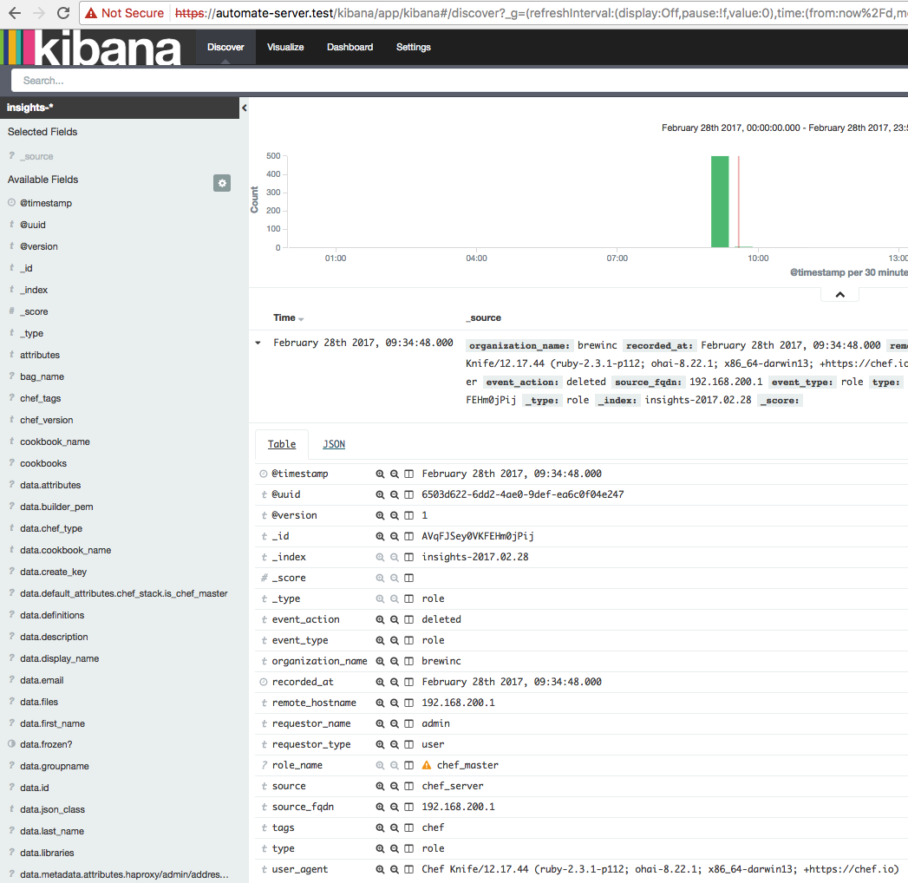

# Chef Office Hour: Mining Automate's Visibility data with Kibana

Mining Chef Automate's Visibility data for fun and profit.

# Automate + ELK
Automate utilizes the Elasticsearch, Logstash, Kibana stack for long term indexing and archiving of a myriad of interesting metadata.

You can get a sense of what sort of metadata is available via the default charts and graphs on Automate's Workflow and Nodes tabs.

However, if you look under the hood, there is a whole lot more data available..

- Chef Server object modifications
  - Roles
  - Coookbooks
  - Environments
  - Databags
  - Users
  - Orgs
  - etc ..
- Chef Client
  - Node object
  - Resources
    - Total
    - Changed
  - Converge status
  - Stack trace of any failures

With all of that information at your disposal, it is relatively easy to create a really functional dashboard:

# Kibana
Kibana is the visualization interface for the data in Elasticsearch.

For a health status overview page:
`https://your-automate-server.test/kibana/status`

Elasticsearch has a similar health page:
`https://your-automate-server.test/elasticsearch/_cluster/health?pretty=true`

When mining data, you will typically loop over this progression of steps:
 - Discover
 - Visualize
 - Add to Dashboard
 - Repeat

### Discover
Click on the 'Discover' tab and you will get a time sorted list of events in Elasticsearch that match your search criteria and within your search time-range window.

You can modify the search criteria or begin browsing the events.

Examples of using the search:
 - event_type: role AND event_action: deleted
 - event_type: cookbook
 - event_type: converge AND status: failure
 - event_type: user AND event_action: deleted

**Important:** In addition to the Search criteria, select the time range to filter search results:

Give your search a name and Save the search.

### Visualize

Visualize the search results by clicking the 'Visualize' tab next.

Creating a Pie Chart:
- Click 'create new visualization'

- Select a visualization type: 'Pie chart'

- Select New or Saved search.  Use the `event_type: *` Search.
- Select Bucket: `Split Slices`
- Set an aggregation field of `event_action` like the following:

This will create a new Pie Chart visualization with each a slice/bucket for every `event_action` type indexed.

You can easily apply this pattern to other searches and fields as well.

Give the visualization a name and Save it.

### Add to Dashboard
Once you have a Search and associated Visualization defined, it's time to add them to a Dashboard!

Click on the 'Dashboard' tab, then:

 - Click 'New Dashboard'

 
 - Click 'Add Visualization'

 
 - Select one of your saved Vizs

 
 - Rinse and Repeat until you have the dashboard the way you like and have fun spelunking!

## External Elasticsearch

[https://docs.chef.io/setup_visibility_chef_automate.html#use-an-external-elasticsearch-cluster-optional](https://docs.chef.io/setup_visibility_chef_automate.html#use-an-external-elasticsearch-cluster-optional)

Chef Automate uses Elasticsearch to store its data, and the default Chef Automate install includes a single Elasticsearch service. This is sufficient to run production work loads; however for greater data retention and perhaps performance, we recommend using a multi-node Elasticsearch cluster with replication and sharding to store and protect your data.
